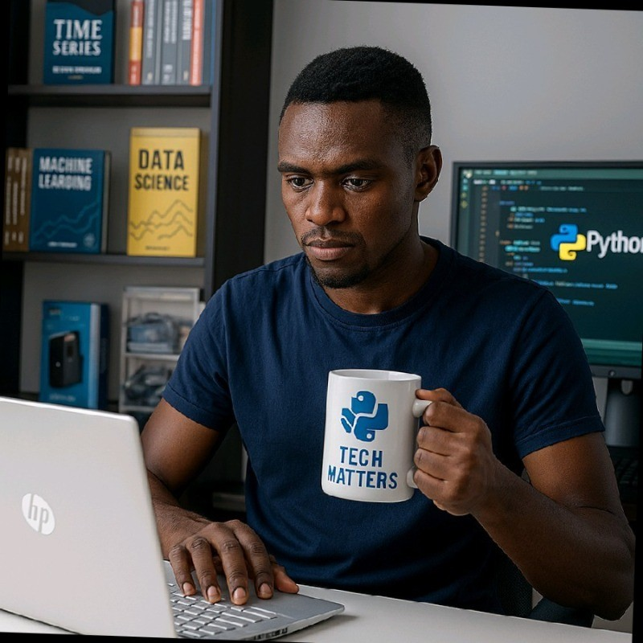

---
hide:
  - header
  - navigation
  - toc
  - footer
---

<!DOCTYPE html>
<html lang="en">
<head>
    <meta charset="UTF-8">
    <meta name="viewport" content="width=device-width, initial-scale=1.0">
    <title>Kenya School of Artificial Intelligence - KSAI</title>
    <meta name="description" content="Africa's premier AI engineering bootcamp">
    
</head>
<body>
    <!-- 
      IMAGE SETUP INSTRUCTIONS
      =========================
      For this page to display correctly, you need to add your images.
      1. Create a folder: `docs/assets/images/`
      2. Place your images inside and name them as follows:
         - `logo.png` (from original: a24b064d-8e2d-4179-b724-1d93c7ecbae8.png)
         - `hero-image.png` (from original: 8061591d-e7b8-4885-9687-7171e5f1bae1.png)
         - `mission-image.jpg` (from original: assets/africa-ai.jpg)
         - `instructor-image.png` (from original: 8061591d-e7b8-4885-9687-7171e5f1bae1.png)
      The paths in this file have been updated to reflect this structure.
    -->

    <!-- Hero Section -->
    <section class="hero-section">
        

            

                
FullStack Machine Learning Engineer: Zero to Deployment

                

                    From idea to data, pipeline to product, become a full-stack ML engineer the industry respects. 
                    FREE for all aspiring engineers
                

            

            <!-- Top Logo -->
            

                
            

            <!-- Main Hero Content -->
            

                <!-- Left: Text Content -->
                

                    
Welcome to

                    <h1 class="hero-title" style="font-size:2.2rem; font-weight:800;">
                        Kenya School of 
                        Artificial Intelligence
                    </h1>
                    

                        You're not just here to learn you're here to 
                        <strong class="highlight">build, lead, and ship</strong> 
                        Africa's next generation of AI.
                    

                    

                        <a href="#cta" class="btn btn-primary" style="background: linear-gradient(135deg,rgb(15, 62, 163), #06b6d4); color: #fff; padding: 0.5rem 1.0rem; font-size: 1rem; border-radius: 0.5rem; font-weight: 400; border: none;">Get Started Free</a>
                        <a href="#mission" class="btn btn-outline" style="border: 2px solid #2563eb; color: #2563eb; padding: 0.5rem 1.0rem; font-size: 1rem; border-radius: 0.5rem; font-weight: 400; background: #fff; margin-left: 0.5rem;">Learn More</a>
                    

                

                <!-- Right: Hero Image -->
                

                    
                    
Empowering AI excellence from Africa to the world.

                

            

        

    </section>

    <!-- Mission Section -->
    <section id="mission" class="mission-section">
        

            <h2 class="section-title" style="font-size:2rem; font-weight:800; color:#222;">Why We Exist</h2>
            
            

                

                    Africa has the talent. Africa has the data. 
                    Now it needs the <strong class="highlight">courage to build</strong> and the discipline to lead.
                

                

                    KSAI is not a classroom. It is a builder's lab  a place where young minds learn not to follow, but to 
                    <strong class="accent-text">execute and lead with excellence</strong>.
                

            

            

                
            

        

    </section>

    <!-- Philosophy Section -->
    <section class="philosophy-section">
        

            

                <h2 class="section-title-white" style="font-size:2rem; font-weight:800; color:#fff;">Before You Write a Single Line of Code, We Need to Rewire Your Brain</h2>
            

            

                <!-- Principle 1 -->
                

                    

                    

                        <h3 class="principle-title" style="font-size:1.2rem; font-weight:700;">First-Principles Thinking</h3>
                        

                            You will not use a tool or a library without understanding the problem it solves and its fundamental trade-offs. 
                            Why Docker over a VM? Why FastAPI over Flask? Why Kubernetes? If your answer is "because a tutorial said so," you're out.
                        

                    

                

                <!-- Principle 2 -->
                

                    

                    

                        <h3 class="principle-title" style="font-size:1.2rem; font-weight:700;">Systems, Not Models</h3>
                        

                            The model is a small, replaceable gear in a vast machine. You are responsible for the entire machine: 
                            the data ingest, the validation pipeline, the feature store, the training infrastructure, the model registry, 
                            the serving API, the monitoring dashboard, and the feedback loop.
                        

                    

                

                <!-- Principle 3 -->
                

                    

                    

                        <h3 class="principle-title" style="font-size:1.2rem; font-weight:700;">Code is a Liability</h3>
                        

                            Every line of code you write is a future bug, a maintenance cost, and a point of failure. 
                            The best engineers don't write more code; they write the least amount of code necessary to build 
                            a robust, scalable, and maintainable system.
                        

                    

                

                <!-- Principle 4 -->
                

                    

                    

                        <h3 class="principle-title" style="font-size:1.2rem; font-weight:700;">Extreme Ownership</h3>
                        

                            The data pipeline broke at 3 AM? That's your problem. The model is drifting in production? Your problem. 
                            The API latency spiked? Your problem. You own the system, end-to-end. No excuses.
                        

                    

                

            

            

                

                    

                        This is your new religion. 
                        Burn it into your memory.
                    

                

            

        

    </section>

    <!-- Pillars Section -->
    <section class="pillars-section">
        

            <h2 class="section-title" style="font-size:2rem; font-weight:800; color:#222;">What Makes KSAI Different</h2>
            
            

                

                    

                    <h3 class="pillar-title" style="font-size:1.2rem; font-weight:700;">Built for Africa</h3>
                    
Real-world problems. Local-first data. Human-centered design.

                

                

                    

                    <h3 class="pillar-title" style="font-size:1.2rem; font-weight:700;">Engineer-First</h3>
                    
No grades. No lectures. Only code, collaboration, and shipping real projects.

                

                

                    

                    <h3 class="pillar-title" style="font-size:1.2rem; font-weight:700;">Startup Mindset</h3>
                    
Think like a founder. Build like a product team. Launch like a startup.

                

            

        

    </section>

    <!-- CTA Section -->
    <section id="cta" class="cta-section" style="background: linear-gradient(135deg, #1e293b 0%, #2563eb 100%);">
        

            <h2 class="cta-title" style="font-size:2rem; font-weight:800; color:#fff;">Your Mission Starts Now</h2>
            

                Begin with <strong>Module 0: Foundations of Applied AI Engineering</strong> 
                This is your environment, mindset, and method — the foundations of all great engineering.
            

            <a href="module0/lesson0.1_workshop/" class="btn btn-cta">Start Building →</a>
        

    </section>

    <!-- Community Section -->
    <section class="community-section">
        

            <h2 class="section-title" style="font-size:2rem; font-weight:800; color:#222;">Join the KSAI Community</h2>
            

                Don't learn in isolation. Become part of a growing tribe of AI engineers across Africa. 
                Build together. Share breakthroughs.
            

            

                <a href="https://chat.whatsapp.com/Hth07uBSP93BukTt0abmMO" class="social-btn whatsapp" target="_blank" rel="noopener noreferrer" style="background:#25D366; color:#fff; padding:0.8rem 2rem; border-radius:0.7rem; font-weight:600; font-size:1.1rem; box-shadow:0 2px 8px rgba(0,0,0,0.08); margin:0 0.3rem 0.7rem 0; display:inline-block;">WhatsApp</a>
                <a href="https://t.me/yourTelegramChannel" class="social-btn telegram" target="_blank" rel="noopener noreferrer" style="background:#229ED9; color:#fff; padding:0.8rem 2rem; border-radius:0.7rem; font-weight:600; font-size:1.1rem; box-shadow:0 2px 8px rgba(0,0,0,0.08); margin:0 0.3rem 0.7rem 0; display:inline-block;">Telegram</a>
                <a href="https://facebook.com/yourFacebookPage" class="social-btn facebook" target="_blank" rel="noopener noreferrer" style="background:#1877F2; color:#fff; padding:0.8rem 2rem; border-radius:0.7rem; font-weight:600; font-size:1.1rem; box-shadow:0 2px 8px rgba(0,0,0,0.08); margin:0 0.3rem 0.7rem 0; display:inline-block;">Facebook</a>
            

        

    </section>

    <!-- Instructor Section -->
    <section class="instructor-section">
        

            

                <h2 class="section-title" style="font-size:2rem; font-weight:800; color:#222;">Meet Your Instructor</h2>
                
                
                
                

                    <h3 class="instructor-name">Alex Mwirigi</h3>
                    
Founder @ KSAI | AI Engineer

                    
                    

                        I'm building Africa's first AI-powered digital hospital and leading the next generation of engineers 
                        through the Kenya School of Artificial Intelligence.  
                        My expertise spans Machine Learning, Deep Learning, MLOps, and product-focused startup execution. 
                        I don't teach theory  I deliver real, production-ready solutions to African challenges.
                    

                

                

                    <a href="tel:+254111475368" class="contact-link">📞 +254 111 475 368</a>
                    <a href="mailto:mwirigialex@351@gmail.com" class="contact-link">✉️ mwirigialex351@gmail.com</a>
                

                <a href="https://www.linkedin.com/in/alex-mwirigi-a15b2826b" class="btn btn-linkedin" target="_blank" rel="noopener noreferrer" style="background:#0a66c2; color:#fff; font-weight:600; padding:0.7rem 1.5rem; border-radius:0.5rem; font-size:1rem; box-shadow:0 2px 8px rgba(0,0,0,0.08); border:none; display:inline-block;">Connect on LinkedIn →</a>
            

        

    </section>

    <!-- Contact Section -->
    <section class="contact-section">
        

            

                <h3 class="contact-title" style="font-size:1.2rem; font-weight:700;">Hire Me or Say Hello</h3>
                
                

                    <a href="tel:+254111475368" class="contact-link">📞 +254 111 475 368</a>
                    <a href="mailto:mwirigialex351@gmail.com" class="contact-link">✉️ mwirigialex351@gmail.com</a>
                

                <a href="https://www.linkedin.com/in/alex-mwirigi-a15b2826b" class="btn btn-linkedin" target="_blank" rel="noopener noreferrer" style="background:#0a66c2; color:#fff; font-weight:600; padding:0.7rem 1.5rem; border-radius:0.5rem; font-size:1rem; box-shadow:0 2px 8px rgba(0,0,0,0.08); border:none; display:inline-block;">View LinkedIn Profile</a>

                

                    <h3 class="support-title" style="font-size:1.2rem; font-weight:700;">Support the Mission</h3>
                    

                        If this vision inspires you, help us push further. <strong>Buy me a coffee</strong> and be part of the movement.
                    

                    <a href="tel:+254111475368" class="btn btn-coffee">☕ Call: +254 111 475 368</a>
                

            

        

    </section>

    <!-- Footer -->
    <footer class="footer">
        

            

                © 2025 <strong>Kenya School of Artificial Intelligence</strong>. All rights reserved.
            

            

                Built with vision, discipline, and purpose in 🇰🇪 Kenya for Africa.
            

            

                Crafted by <strong class="credit-name">Alex Mwirigi</strong> · Founder & AI Engineer
            

        

    </footer>

    
</body>
</html>