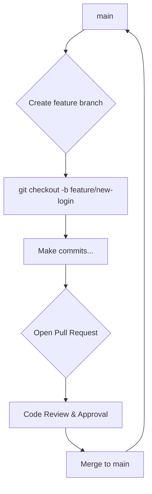

# Module 0: Foundations of Applied AI Engineering
## Lesson 0.2: Designing Technical Architecture

> **The "Why"**: A model without metrics is an opinion.

### Key Concepts & Tools

- **Statistics:**
    - Mean, median, variance
    - Distributions
    - Hypothesis testing
    - Correlation vs. causation
- **Python Libraries:**
    - `pandas.DataFrame.describe()`
    - `matplotlib`/`seaborn` for plotting

### Hands-On Exercise (GitHub Commit)

**Task:** Create a script `eda.py` or a notebook `00-exploratory-data-analysis.ipynb`.

1. Load your dataset into a pandas DataFrame.
2. Compute descriptive statistics using `.describe()`.
3. Generate and save visualizations:
    - Histograms for key numerical features.
    - Box plots for categorical vs. numerical data.
    - A correlation heatmap.
4. Add a markdown summary of your initial findings.

!!! warning "Instructor Notes & Pitfalls"
    **Pitfall:** Students will be tempted to skip deep EDA to get to the "fun" modeling part.

    **Guidance:** Emphasize that EDA is the most critical step. It prevents the "garbage-in, garbage-out" problem. Ask them: *"What's the most surprising thing you found in the data? How might that affect the model you build?"*

<!-- In module0/lesson0.2_blueprint.md -->

Our Git branching flow follows this pattern:

